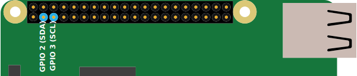
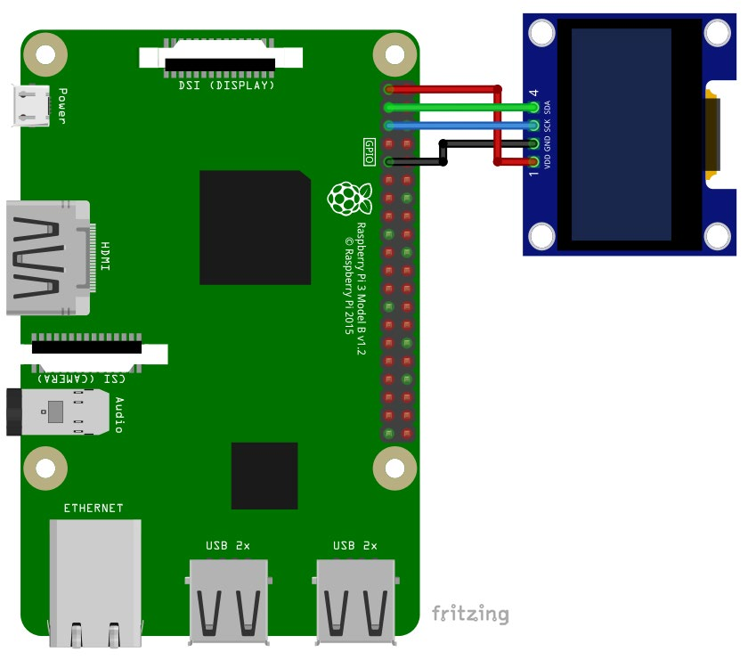

# i2clib
Rust i2c manipulation library designed for Raspberry PI devices. Initial 
creation made for AZDelivery OLED i2c displays

## Simple Example
This library is written in Rust, so in this example we will use the Rust 
language and the Cargo tool. Another language ? Without Cargo ? Let's see the 
[other examples](#other-examples)

Generate a project with Cargo by running `$ cargo init` in your shell at the
directory you chosen earlier.
Edit "Cargo.toml" file and add the following part:
```toml
[dependencies]
i2clib = { git = "https://github.com/antoninhrlt/i2clib" }
```

Now edit your main file: "src/main.rs", it should look like this after:
```rust
use i2clib::*;

fn main() {
    // nothing to show for the moment
}
```

## Good instructions for good usage
- ### What's my screen's i2c address ?
    To find your screen's i2c address, simply check on your screen an
    inscription "0x...". Considering being on a 7 bits base, perform this
    calculation: (example with 0x78 found on your screen, but written as 8 bits
    hexadecimal number)
    > 0x78 = 01111000 (as 8 bits in binary) \
    > = 0111100 (as 7 bits in binary) = 0x3c (as hexadecimal)

    (from [https://passionelectronique.fr](https://passionelectronique.fr/ecran-oled-i2c-arduino/) in French)

- ### What is my screen's port ?
  Open a terminal on your Raspberry PI and type: 
  `ls /dev/ | grep "i2c-"` and you get for example: `i2c-1`, so "1" is your 
  port ! 

- ### How to connect my screen ?
    These are the two most important GPIO ports that we will use.

     

    (picture taken from [abelectronics.co.uk](https://www.abelectronics.co.uk/kb/article/1/i2c-part-2---enabling-i-c-on-the-raspberry-pi)
    , thanks a lot)

    And now connect by cables your screen to the Raspberry PI following this 
    scheme: 

     

    (picture taken from the book "[AZ-Delivery](https://www.az-delivery.de/fr) 1,3”
    OLED I2C", thanks a lot)

    By evidence, you can select another port to connect the black cable 
    (ground) if it's a "ground" port, and also for the 3V3 port you can choose
    another, like emplacement 17, as long as it's a 3V3 port. 
    But the two GPIO ports presented above are the only possibilities to work 
    with i2c.

- ## How to enable i2C on Raspberry PI ?
    The following instructions are a tutorial to explain how to connect a screen
    to your Raspberry PI (only with a Linux system like Raspbian). During this
    tutorial I will considering you don't have any monitor connected and all can 
    be done with the simple shell.
    - Turn on your Raspberry PI.
    - Type this in the terminal: `$ sudo raspi-config`, go to "3 Interface 
    Options" and then "P5  I2C", enable it by press enter two times.
    [Screenshots here](share/)
    - Exit the Raspberry's config menu by press "echap".
    - Restart your Raspberry PI.
    - All done !

# 

## Other Examples
### With the C language
```c
// nothing to show for the moment
```

### Without Cargo but Rust
```rust
// nothing to show for the moment
```